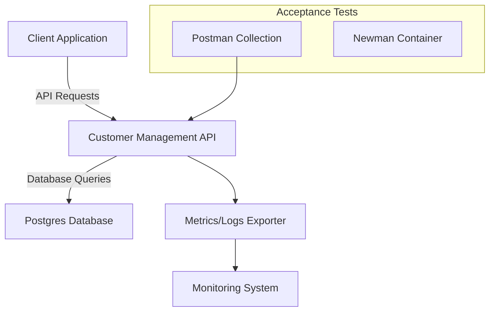
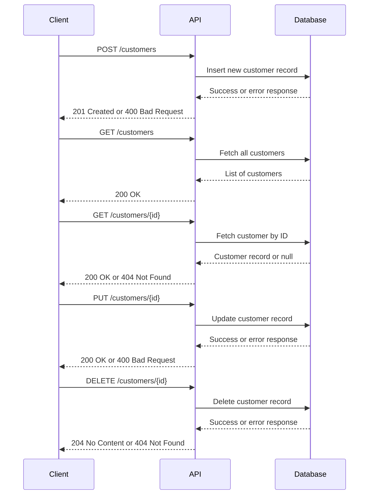

# Customer Management API

This project provides a RESTful API for managing customer data. It uses **Kotlin**, **Spring Boot**, **Postgres**, and **jOOQ** for type-safe database interactions. The API supports basic CRUD operations, along with validations, custom exception handling, and observability. It also includes automated acceptance testing, containerization for deployment, and instructions for Kubernetes integration.

**Key Features:**

- **Kotlin + Spring Boot**: Simple, concise, and robust backend.
- **Postgres + jOOQ**: Type-safe SQL queries and schema management.
- **Validation & Exceptions**: Constructor validation and custom HTTP responses.
- **Automated Tests**: Unit and acceptance tests (Postman + Newman).
- **Observability**: Integrated metrics and logs for better visibility.
- **CI/CD**: GitHub Actions pipeline on merges to `main`.
- **Containerization & Kubernetes**: Ready for Docker and K8s deployment.
- **Swagger/OpenAPI**: Interactive API docs locally and via GitHub Pages.

---

## Table of Contents

- [Architecture Overview](#architecture-overview)
- [Setup and Prerequisites](#setup-and-prerequisites)
- [Database Configuration](#database-configuration)
- [Running the Application](#running-the-application)
- [Usage](#usage)
- [API Documentation](#api-documentation)
- [Testing](#testing)
- [CI/CD and Deployment](#cicd-and-deployment)
- [Kubernetes](#kubernetes)
    - [Deploying Locally](#deploying-locally)
- [Contributing](#contributing)

---

## Architecture Overview



### Sequence Diagram



**Components:**

- **Client Application**: A CLI tool, frontend, or any HTTP client consuming the API.
- **Customer Management API**: Spring Boot application exposing CRUD endpoints.
- **Postgres Database**: Stores customer records. Interacted with via jOOQ.
- **Monitoring System**: Could be Prometheus/Grafana or external APM tools.
- **Tests**: Postman + Newman for end-to-end acceptance testing.

---

## Setup and Prerequisites

### Prerequisites

1. **Java 21+**: Install from [Amazon Corretto](https://aws.amazon.com/corretto/) or your package manager.
2. **Maven 3.8+**: Verify installation with `mvn -v`.
3. **Docker & Docker Compose**: For running Postgres and Newman tests easily.
4. **Postgres**: Run locally or via Docker.

### Repository

Clone the repository:

```bash
git clone https://github.com/aaiezza/customer-management-api.git
cd customer-management-api
```

---

## Database Configuration

Start the database:

```bash
docker-compose up -d
```

Environment Variables (in `.env` or your environment):

```env
DATABASE_URL=jdbc:postgresql://localhost:5432/customer_db
DATABASE_USER=customer_user
DATABASE_PASSWORD=customer_pass
```

Reset the local database:
```bash
docker-compose down
docker volume rm customer-management-api_postgres_data
docker-compose up database --build -d
mvn flyway:migrate -P flyway
```

---

## Running the Application

Build the project:

```bash
mvn clean install
```

Run the application:

```bash
mvn spring-boot:run
```

The API is now available at: [http://localhost:8080](http://localhost:8080)

To containerize:

```bash
docker build -t aaiezza/customer-management-api .
docker run -p 8080:8080 --env-file .env aaiezza/customer-management-api
```

---

## Usage

**Endpoints:**

- **Create a Customer**: `POST /customers`
- **List Customers**: `GET /customers`
- **Get Customer by ID**: `GET /customers/{id}`
- **Update a Customer**: `PUT /customers/{id}`
- **Delete a Customer**: `DELETE /customers/{id}`

Use `curl`, Postman, or any HTTP client to interact with the API.

---

## API Documentation

- **Swagger UI:** [View API Documentation](https://aaiezza.github.io/customer-management-api/docs/swagger/)

The Swagger UI provides an interactive interface for exploring and testing the API endpoints defined in the [OpenAPI Specification](docs/openapi.yaml).

### Swagger Generation Steps:

1. Install and run the `swaggerapi/swagger-ui` Docker container to serve your OpenAPI spec.
2. Extract Swagger static files:
   ```bash
   docker create --name swagger-ui-extract swaggerapi/swagger-ui
   docker cp swagger-ui-extract:/usr/share/nginx/html ./swagger-static
   docker rm swagger-ui-extract
   ```
3. Move `swagger-static` into `docs/swagger`:

```bash
mv swagger-static docs/swagger
```

4. Update `docs/swagger/swagger-initializer.js` to reference the OpenAPI spec:

```javascript
url: "../openapi.yaml"
```

5. Commit and push changes, then enable GitHub Pages to serve from the `docs` folder.

---

## jOOQ Code Generation

jOOQ generates type-safe database schema classes. To run the code generation:

1. Ensure the database is running and reachable.
2. Run the following Maven command:

   ```bash
   mvn clean install -Pjooq-codegen
   ```

This will generate the database schema classes in `target/generated-sources/jooq`.

---

## Testing

1. **Unit Tests**:

   ```bash
   mvn test
   ```

2. **Acceptance Tests (Postman + Newman)**:

    - Ensure `postman/collection.json` is available.
    - Run with Newman:
      ```bash
      docker run -v $(pwd)/postman:/etc/newman postman/newman run /etc/newman/collection.json
      ```

---

## CI/CD and Deployment

**GitHub Actions Workflow:**

- Set up a workflow in `.github/workflows/ci.yml` that triggers on merges to `main`.
    - Steps:
        1. Checkout code.
        2. Set up Java and build with Maven.
        3. Run unit and acceptance tests.
        4. Build and push Docker image to a registry.
        5. Deploy to test or prod environments if configured.

---

## Kubernetes

To deploy to Kubernetes:

1. Create `deployment.yaml` and `service.yaml` in `k8s/`:

   ```yaml
   apiVersion: apps/v1
   kind: Deployment
   metadata:
     name: customer-management-api
   spec:
     replicas: 2
     selector:
       matchLabels:
         app: customer-management-api
     template:
       metadata:
         labels:
           app: customer-management-api
       spec:
         containers:
         - name: customer-management-api
           image: aaiezza/customer-management-api:latest
           ports:
           - containerPort: 8080
   ```

2. Deploy:

   ```bash
   kubectl apply -f k8s/
   ```

3. Access the application via `kubectl port-forward` or a LoadBalancer/Ingress.

### Deploying Locally

To deploy the application locally using Kubernetes:

1. **Start Minikube:**
   ```bash
   minikube start
   ```

2. **Load the Docker image into Minikube:**
   ```bash
   minikube image load aaiezza/customer-management-api:latest
   ```

3. **Apply the Kubernetes Manifests:**
   ```bash
   kubectl apply -f k8s/
   ```

4. **Access the Application:**
   Use `kubectl port-forward` to expose the application locally:
   ```bash
   kubectl port-forward service/customer-management-api 8080:8080
   ```

   Alternatively, enable the Minikube service tunnel:
   ```bash
   minikube service customer-management-api
   ```

5. **Verify Deployment:**
   Check the status of the pods:
   ```bash
   kubectl get pods
   ```
   Ensure all pods are in the `Running` state.

6. **Watch the Pods:**
   To monitor the state of pods in real time, use:
   ```bash
   kubectl get pods --watch
   ```

7. **Rollout and Restart:**
   If you need to deploy updated code or configurations, perform a rollout restart:
   ```bash
   kubectl rollout restart deployment/customer-management-api
   ```
   To check the status of the rollout:
   ```bash
   kubectl rollout status deployment/customer-management-api
   ```

8. **Run Flyway Migrations:**
   To apply Flyway migrations to the Postgres database deployed in Kubernetes, use a Kubernetes job or a local Flyway container.

   **Option 1: Run as a Kubernetes Job**
   ```bash
   kubectl create job flyway-migration --image=flyway/flyway -- \
   -url=jdbc:postgresql://postgres-service:5432/customer_db \
   -user=customer_user -password=customer_pass migrate
   ```

   **Option 2: Run Flyway Locally (with Port Forwarding)**
   ```bash
   kubectl port-forward service/postgres-service 5432:5432
   docker run --rm -v $(pwd)/sql:/flyway/sql flyway/flyway:latest \
   -url=jdbc:postgresql://localhost:5432/customer_db \
   -user=customer_user -password=customer_pass migrate
   ```

1. **Start Minikube:**
   ```bash
   minikube start
   ```

2. **Load the Docker image into Minikube:**
   ```bash
   minikube image load aaiezza/customer-management-api:latest
   ```

3. **Apply the Kubernetes Manifests:**
   ```bash
   kubectl apply -f k8s/
   ```

4. **Access the Application:**
   Use `kubectl port-forward` to expose the application locally:
   ```bash
   kubectl port-forward service/customer-management-api 8080:8080
   ```

   Alternatively, enable the Minikube service tunnel:
   ```bash
   minikube service customer-management-api
   ```

5. **Verify Deployment:**
   Check the status of the pods:
   ```bash
   kubectl get pods
   ```
   Ensure all pods are in the `Running` state.

---

## Contributing

1. Fork the repository and create a feature branch.
2. Commit changes with descriptive messages.
3. Open a Pull Request against `main`.
4. Contributions are welcomed and reviewed promptly.

